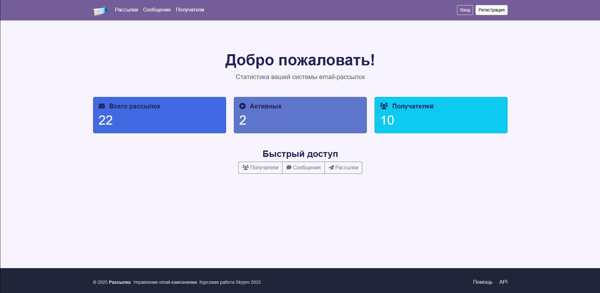
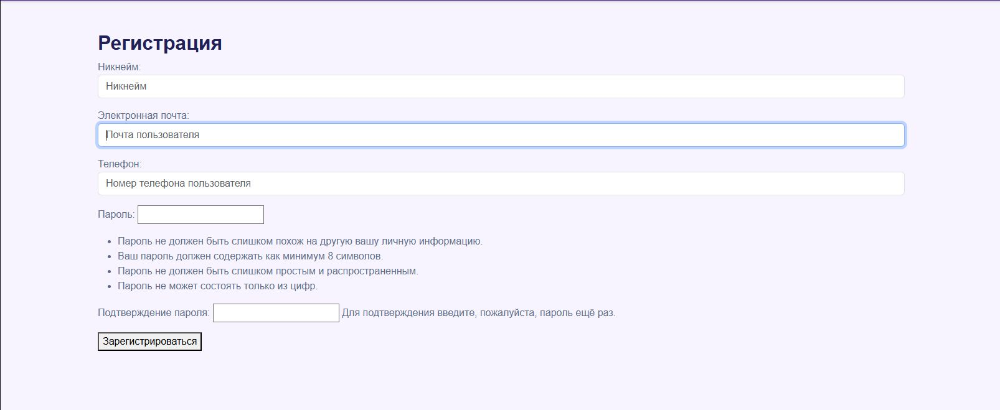
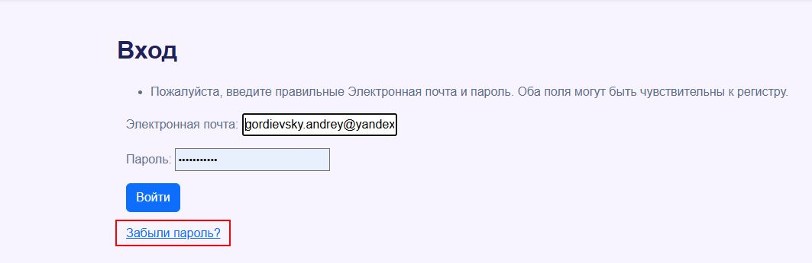
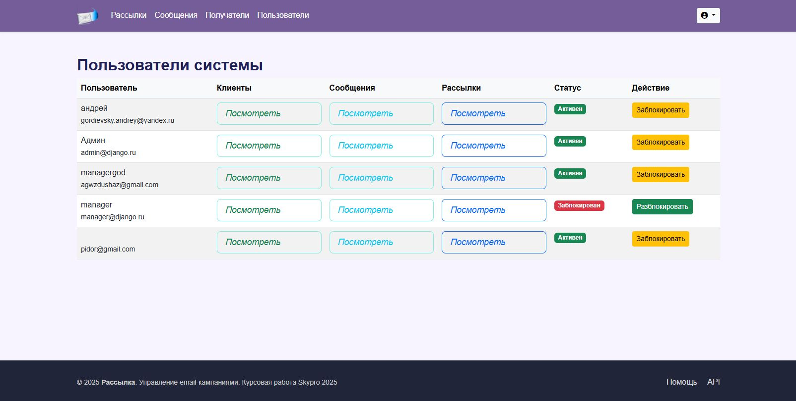

# 📨 MailService — Система управления email-рассылками

# 🔖 Описание проекта:

Данный проект является сервисом рассылок по email на фреймворке DJANGO.

# 🔧 Установка компонентов:


1. Создайте проект и установите poetry:


```pip install --user poetry```


2. Установите инструменты для реализации сервиса:


[]( https://www.djangoproject.com/ )
[]( https://pypi.org/project/python-dotenv/ )
[]( https://pypi.org/project/psycopg2/ )
[]( https://pypi.org/project/Pillow/ )
[]( https://pypi.org/project/ipython/ )


КОМАНДЫ ДЛЯ ЗАПУСКА ФРЕЙМВОРКА И ПРИЛОЖЕНИЯ
```
poetry add django # Установка
poetry add pillow # Установка библиотеки для работы с изображениями
poetry add dotenv # Установка библиотеки для работы с чувствительными данными
poetry add ipython # Установка библиотеки для работы с чувствительными данными

django-admin startproject config . # Старт нового проекта
django-admin startproject myproject # Старт нового приложения

python manage.py createsuperuser # дать суперпользователя для админки.
При выполнении этой команды необходимо указать имя пользователя и пароль.
Адрес электронной почты является опциональным параметром.

python manage.py run_send_mail.py # комманда отправки всех активных рассылок, если они есть.
python manage.py create_manage_group.py # команда создает группу "Менеджеры" с правами просмотра сообщений,
получателей и рассылок.

P.s. назначить пользователя в группу менеджеров возможна через админку или django shell 

python manage.py shell -i ipython #Запуск DJANGO SHELL

```

# ✒️ Использование
Основное использование приложения запускается из файла *manage.py*

```
python -Xutf8 manage.py dumpdata catalog.Category --output category_fixture.json --indent 4  #Гененрация фикстуры модели
python manage.py loaddata products_fixture_load.json --database=default --ignorenonexistent #Загрузка данных из фикстуры
python manage.py add_test_product # запуск кастомной функции добавление тестового продукта(старые данные стираются!)

```

Проверка работоспособности redis брокера кэширования через shell
```
from django.core.cache import cache

# Попробуем записать и прочитать из кэша
cache.set('test_key', 'работает!', 30)  # сохраняем на 30 секунд
result = cache.get('test_key')
print(result)  # Должно вывести: работает!
```
️ ВАЖНО ⚠️
```
python manage.py runserver 8080 # Запуск сервера
CTRL+С # Отключение сервера
```
### 🌐 Пример страниц:
*Главная страница*


*Страница регистрации*


*Страница входа*

**При вводе неправильного пароля при входе, появляется ссылка на страницу восстановления по email**

**В модуле services.py организовано логирование в консоль, для отладки программы рассылки**
```
logger = logging.getLogger(__name__)


def send_mailing(mailing):
    """
    Отправляет рассылку, проверяет время, обновляет статус.
    """
    print("🔹" * 50)
    print(f"🎯 send_mailing вызвана для ID={mailing.pk}")
    print(f"   Текущий статус: {mailing.status}")
    print(f"   Время завершения рассылки: {mailing.end_datetime}")
    print(f"   Текущее время: {timezone.now()}")

    logger.info(f"=== НАЧАЛО ОТПРАВКИ РАССЫЛКИ ID={mailing.pk} ===")
    logger.info(f"Текущий статус: {mailing.status}")

    # 1. Уже завершена — выходим
    if mailing.status == 'completed':
        logger.warning(f"Рассылка {mailing.pk} уже завершена. Выход.")
        print("❌ Уже завершена — выход.")
        return
```

### Работа с правами:

- Организовано управление менеджером и админом просмотра сообщений рассылки, самих рассылок, получателей.
- Админ и менеджер может заблокировать рассылку и обратно ее включить нельзя
- Админ и менеджер вправе заблокировать пользователя(реализована защита от самоблокирования)

*Страница входа для менеджера и админа*


*Страница входа для менеджера и админа*


*Страница блокировки пользователей для менеджера и админа*
